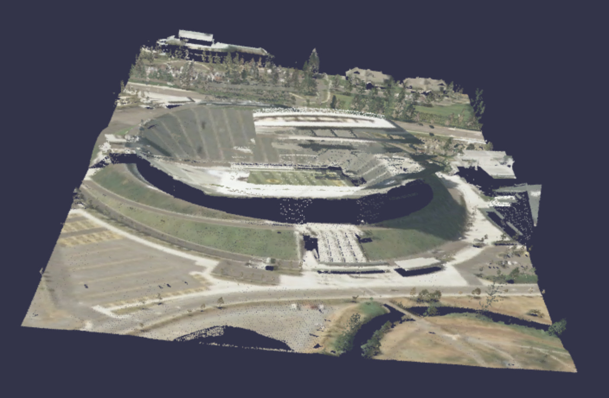

# TileDB-PyBabylonJS

[](https://codecov.io/gh/TileDB-Inc/PyBabylonJS)
[](https://dev.azure.com/TileDB-Inc/CI/_build/latest?definitionId=37&branchName=main)


The TileDB-PyBabylonJS library is a geospatial data visualization Python library that interactively visualizes TileDB arrays with [Babylon.js](https://www.babylonjs.com) in a Jupyter notebook widget. 

## Installation

This project is available from [PyPI](https://pypi.org/project/pybabylonjs/) and can be installed with `pip`:

```bash
pip install pybabylonjs
```

If you are using Jupyter Notebook 5.2 or earlier, you may also need to enable
the nbextension:
```bash
jupyter nbextension enable --py [--sys-prefix|--user|--system] pybabylonjs
```

## Development Installation

Create and activate a dev environment:

```bash
conda install -c conda-forge mamba

mamba create -n pybabylonjs-dev -c conda-forge nodejs yarn python=3.7.10 tree scipy 'pyarrow>2' numpy pandas tiledb-py rasterio gdal pdal python-pdal jupyter-packaging jupyterlab

conda activate pybabylonjs-dev

pip install opencv-python
```

Fork or clone the repo and go the main directory. Install the TileDB-PyBabylonJS Python package that will also build the TypeScript package:

```bash
pip install -e ".[test, examples]"
```

When developing your extensions, you need to manually enable your extensions with the notebook / lab frontend. For jupyter lab, this is done by the command:

```bash
jupyter labextension install @jupyter-widgets/jupyterlab-manager
yarn run build
jupyter labextension install .
```

For a classic notebook, you need to run:

```bash
jupyter nbextension install --sys-prefix --symlink --overwrite --py pybabylonjs
jupyter nbextension enable --sys-prefix --py pybabylonjs
```

Note that the `--symlink` flag doesn't work on Windows, so you will here have to run
the `install` command every time that you rebuild your extension. For certain installations
you might also need another flag instead of `--sys-prefix`, but we won't cover the meaning
of those flags here.

### How to see your changes

#### TypeScript

If you use JupyterLab to develop then you can watch the source directory and run JupyterLab at the same time in different
terminals to watch for changes in the extension's source and automatically rebuild the widget.

```bash
# Watch the source directory in one terminal, automatically rebuilding when needed
yarn run watch
# Run JupyterLab in another terminal
jupyter lab
```

After a change wait for the build to finish and then refresh your browser and the changes should take effect.

To add a TypeScript package use [yarn](https://classic.yarnpkg.com/lang/en/docs/cli/add/): 

```bash
yarn add <package-name>
yarn add --dev <dev-package-name>
``` 

#### Python

If you make a change to the python code then you will need to restart the notebook kernel to have it take effect.

## Usage

### Point clouds

Jupyter notebooks are provided in the [Examples folder](https://github.com/TileDB-Inc/TileDB-PyBabylonJS/tree/main/examples) for the following visualizations:

* [Point cloud](/examples/point_cloud.ipynb)
* [Point cloud with a time slider](/examples/point-cloud-time.ipynb)
* [Point cloud with a classes slider](/examples/point-cloud-classes.ipynb)
* [Point cloud with a Mapbox base map](/examples/point-cloud-topo.ipynb)
* [Point cloud with gltf models](/examples/point-cloud-gltf.ipynb)
* [MBRS of a point cloud](/examples/mbrs.ipynb)

Display a point cloud visualization from a local sparse array by specifying the bounding box of a slice of the data:

```python
from pybabylonjs import Show as show

bbox = {
    'X': [636800, 637800],
    'Y': [851000, 853000],
    'Z': [406.14, 615.26]
}

lidar_array = "autzen-classified"

show.point_cloud(source="local",
                 uri=lidar_array,
                 bbox = bbox)
```



To add a slider over `GpsTime` change the `mode` to `time`:

```python
show.point_cloud(source="local",
                 mode="time",
                 uri=uri,
                 bbox=bbox)
```    

